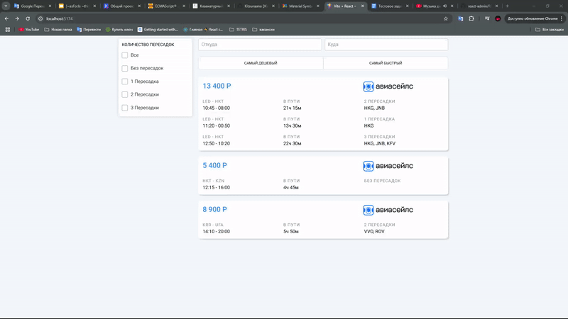
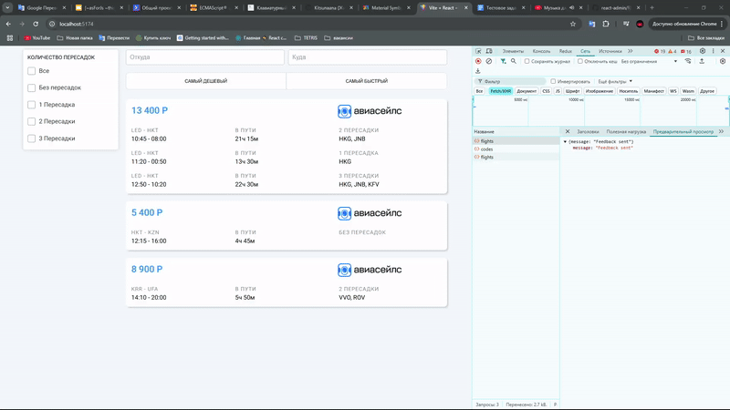
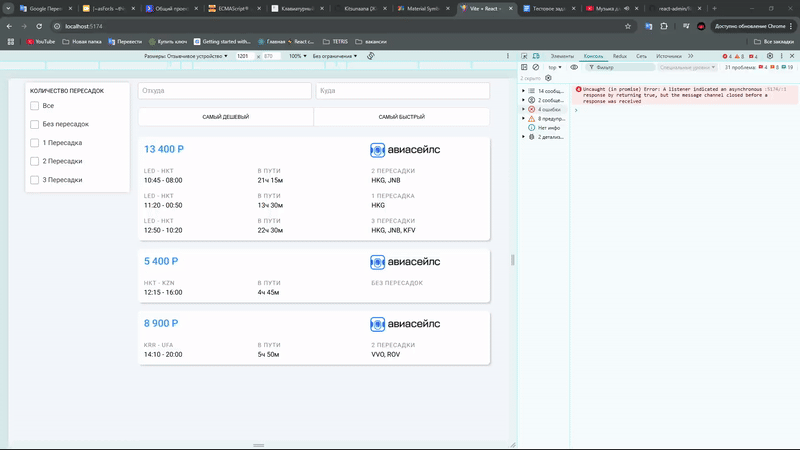
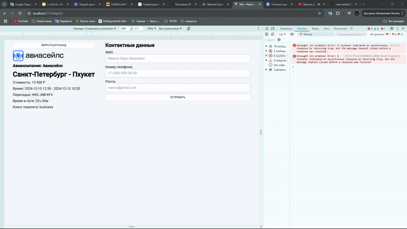

# Установка
```shell
npm install
```
```shell
cd server && npm install
```

# Запуск
```bash
npm run dev
```
```bash
cd server && npm run dev
```

# Описание
## Фильтрация, сортировка и поиск
Все эти функции я всегда реализую на стороне сервера при запросе к БД. Это дает возможность реализовывать пагинацию и бесконечную загрузку с использованием SQL, например, Sequelize. Однако, так как в задании было указано использовать только React, мне пришлось выполнять все эти действия на клиенте, чего я обычно в разработке не стал бы делать.

## Нотификация
При отправке форм я всегда уведомляю с помощью notify, что запрос успешно выполнен или, наоборот, что есть ошибки. Однако, по требованиям задания различные плагины использовать нельзя.

## Поиск
По-хорошему, стоило бы использовать debounce, но так как запросов нет и все высчитывается на клиенте, я не стал его использовать — просто нет необходимости.

# Демонстрация работы
## Фильтрация, сортировка и поиск


## Страница с информацией о рейсе


## Адаптив страницы со всеми рейсами


## Адаптив страницы с информацией о рейсе



# Пример других моих работ
Тестовое задание в компанию Спутник: 
 - Репозиторий: https://github.com/Kitsunaana/todo-list

Собственный авторский проект:
 - Репозиторий: https://github.com/Kitsunaana/react-admin (Временно в привате, т.к. провожу глобальный рефакторинг)
 - Страница сайта: https://kitsunaana.store (Доступно)

